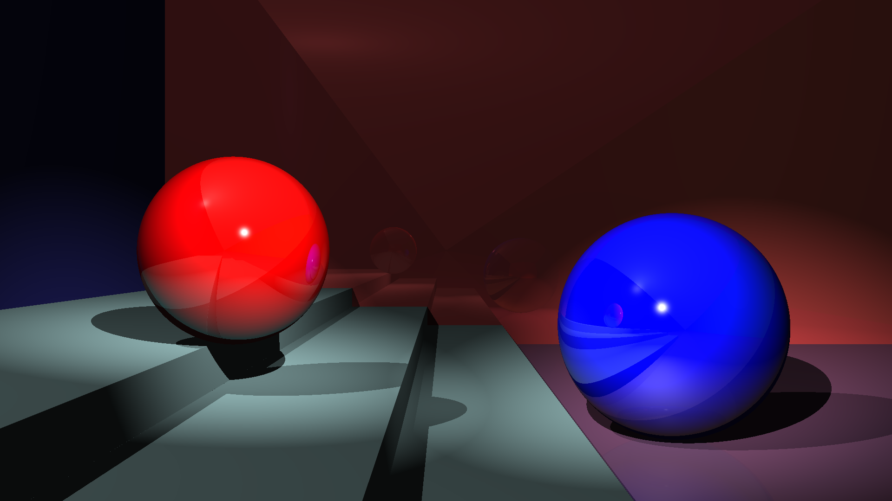

# JOCLRay
JOCLRay is an attempt to implement basic ray tracing on GPU via OpenCL kernels, yet maintaining a high-level interface to describe the scene to be rendered and trying to keep the design modular.

## Features
- Ray casting, ray-object intersections, and shading run on GPU as OpenCL kernels.
- Object-oriented, dynamic scene description.
- Supported surface types: Sphere, Plane, Box.
- Supported light types: Point light, Spotlight with angle and attenuation.
- "Shading" renderer implementing Blinn-Phong lighting model with shadows and an arbitrary number of reflection bounces.
- "Visibility" renderer for visualizing intersection with view rays only.

## How to build

In order to build  JOCLRay you need JDK 10+ and Apache Maven. After cloning the repository, you can build JOCLRay from the repository root with
``` 
mvn package
```
This will build JOCLRay and package it to a JAR file with dependencies named `joclray-1.0-SNAPSHOT-jar-with-dependencies.jar` located in the `target` directory.

## Running JOCLRay
To run JOCLRay you need and at least one OpenCL-compatible device, and the appropriate drivers installed on your system.

Once JOCLRay is built, you can run it with
```
java -jar ./target/joclray-1.0-SNAPSHOT-jar-with-dependencies.jar
```

JOCLRay has a few command line options you can explore with the `--help` option.

## Sample scenes

### Scene 1


- FOV (grad): 50
- Lights: 3 point lights, 1 spot light
- Objects: 8
- Reflection bounces: 4

Rendering times on my laptop (Intel(R) Core(TM) i7-8550U CPU @ 1.80GHz, 16GB RAM, NVIDIA GeForce MX150) for both NVIDIA and Intel GPU. Reported rendering time is the average over 10 sequential runs, discarding the first one in which compilation of OpenCL kernels happens.

GPU         | Rendering Time
----------- | -------------
NVIDIA GeForce MX150    | 1.3s
Intel UHD Graphics 620  | 3.4s


### Scene 2


- FOV (grad): 30
- Lights: 3 point lights, 2 spot lights
- Objects: 10
- Reflection bounces: 4

Rendering times on my laptop (Intel(R) Core(TM) i7-8550U CPU @ 1.80GHz, 16GB RAM, NVIDIA GeForce MX150) for both NVIDIA and Intel GPU. Reported rendering time is the average over 10 sequential runs, discarding the first one in which compilation of OpenCL kernels happens.

GPU         | Rendering Time
----------- | -------------
NVIDIA GeForce MX150    | 1.6s
Intel UHD Graphics 620  | 3.5s

## Limitations and Future Work
- Extend the renderer to make use of multiple OpenCL devices.
- Surfaces in the scene are grouped by type and an intersection kernel is scheduled on the GPU for each group. Thus, each GPU thread calculates intersections for a `<ray, element>` pair. However, currently, there is no reduction step to merge the results and the memory access model may lead to the corruption of the buffer holding intersections results.
- Shadow rays generation and their intersections are calculated on the GPU, whereas the results are merged on CPU into a light-intensity map that associates an intensity value to each `<ray,light>`. Try to move the whole process to GPU and find a more compact data structure to represent the contribution of each light for each primary ray.
- Parallelize shading across lights.
- Camera, lights and all the objects are axis-aligned, as there is no support for transformations.
- Support more primitives and loading of polygonal models.
- Support more material properties (e.g., refractive materials)
- Simplify code for wrappers and buffer management.
- Unit tests
- ...